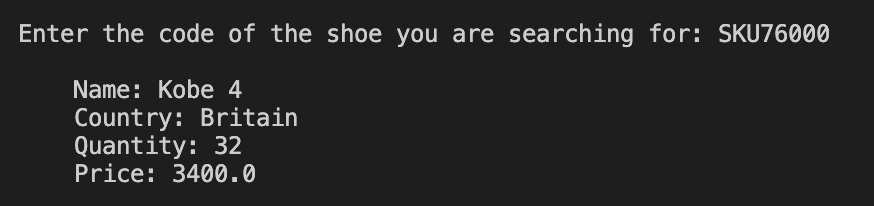

# Capstone IV: Object-Oriented Programming
## Here is the code for my fourth capstone project, _inventory.py_. 
#
This program uses OOP to create a shoe inventory.
For each shoe in the inventory, the following information is available:
* Country
* Code
* Product name
* Cost
* Quantity
* Value

The user is able to do the following: 
* Search products by code
* Determine the product with the lowest quantity and restock it
* Determine the product with the highest quantity
* Calculate the total value of each stock item

#
## Using this file
Before using the menu, ensure you have read in all the shoes. This can be done by inputting "re" at the start. If this is not done, an error message will appear stating that there are no shoes in the inventory. 

### **Searching products by code**
Let's say you want to look up a shoe, but you only know the shoe code (e.g., _SKU76000_). You can use the menu to find the shoe by inputting "sh". Here is a demonstration: 

