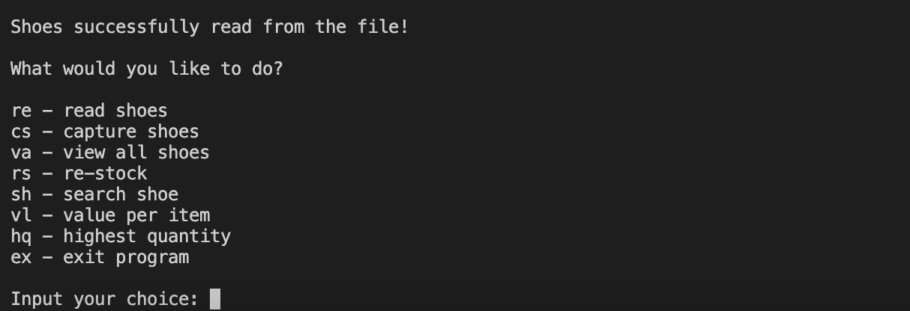
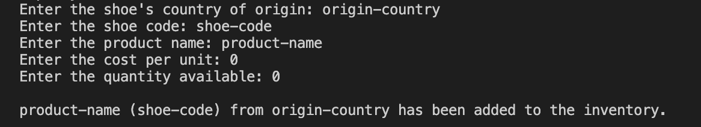
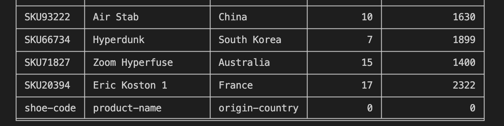

# Capstone IV: Object-Oriented Programming
## Here is the code for my fourth capstone project, _inventory.py_. 
#
This program uses OOP to create a shoe inventory.
For each shoe in the inventory, the following information is available:
* Country
* Code
* Product name
* Cost
* Quantity
* Value

The user is able to do the following: 
* Search products by code
* Determine the product with the lowest quantity and restock it
* Determine the product with the highest quantity
* Calculate the total value of each stock item

#
## Using this file

### **Installation**
Two files are needed to run this program: _inventory.py_ and _inventory.txt_. Ensure these have both been downloaded to the current working directory, otherwise the python file will not be able to fetch data about the shoes from the text file, and the program will not work.

Start by reading in all the shoes. This can be done by inputting "re" when presented with the menu. If this is not done, an error message will appear stating that there are no shoes in the inventory. If everything has been set up correctly, your terminal should look like this: 

### **Searching products by code**
Let's say you want to look up a shoe, but you only know the shoe code (e.g., _SKU76000_). You can use the menu to find the shoe by inputting "sh". Here is a demonstration: 

### **Adding products to inventory**
You just ordered in a new type of shoe, but it doesn't exist in the inventory? Add it with the _capture shoes_ function. Input "cs" and then enter the relevant details. 

Your new shoe has been added to the inventory. You can see it by inputting "va" or "vl" to view all the items in the inventory:

### **Restocking products in inventory**
If you are concerned that your inventory may be running low on a particular shoe, you can restock your inventory with the _restock shoes_ function. Input "rs" to see which products are running out of stock. The program will print out the shoes with the least stock and ask if you want to get more and, if so, how many pairs. Here is a demonstration:

The program has identified the shoe we added earlier - "product-name" - as the shoe with the lowest stock, at zero pairs. After adding two pairs to the inventory, the program checks for the next shoe with the lowest stock, which is still "product-name", though now with two pairs. If you decide not to restock product-name, the program checks if there are any other shoes with the same amount of remaining pairs that you might want to restock. In this case, "Air Mag" also only has two pairs in the inventory. The program will return to the main menu once you have indicated that none of the least-stocked shoes are actually running out.
